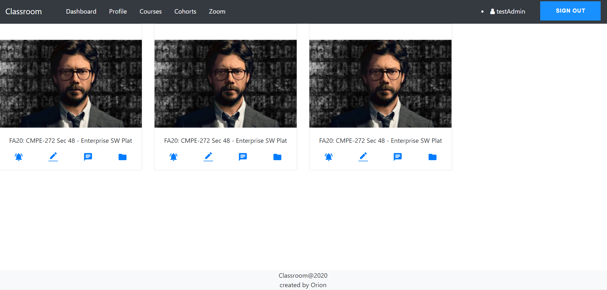
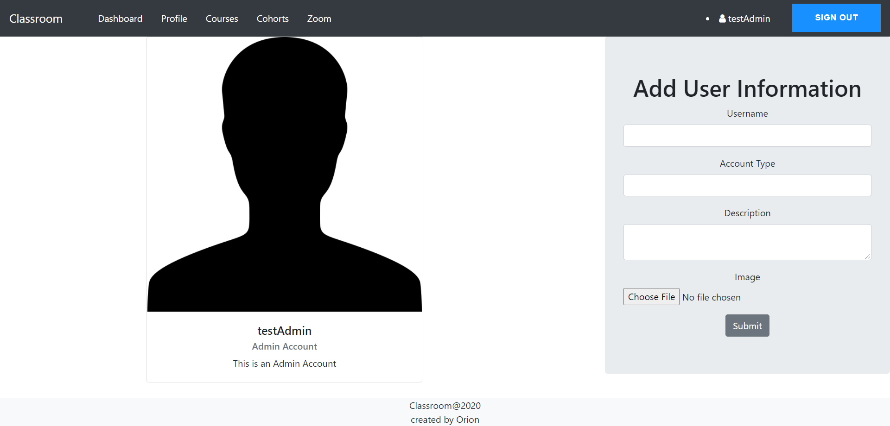
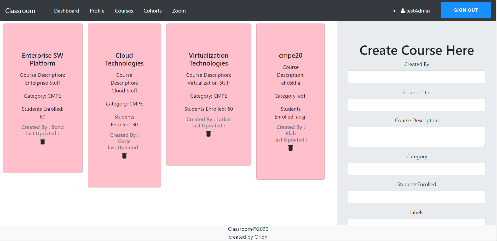
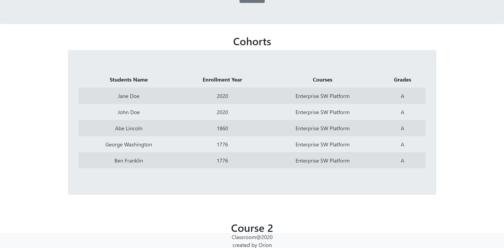

# Classroom
> A Learning Management System that allows better communication between professors and students, where professors can better manage their classes and students are easily informed of any important notifications and class information</a>. 

## Table of contents
* [General info](#general-info)
* [Modules](#modules)
* [Feature List](#feature-list)
* [Installation](#installation)
* [Screenshots](#screenshots)
* [Technologies](#technologies)
* [Contributors](#contributors)
* [Status](#status)

## General info
Classroom is a learning management system that allows for professors and students to communicate remotely; students are able to register for their courses and the professors are able to monitor the registration and the classes. Professors are also able to create courses and upload them to the database with their information.

## Modules

Authentication is essential and a core area of our application development. With AWS Amplify, we have authentication using username and password, in addition to email and SMS notifications for registration so that only authorized users can access their application. Professors are set to the administrator role and have full view of all the students and the courses created, while the students will only get access to the courses in which they are registered in. The process is implemented in Amplify using AWS Amplify Authentication.

For uploading the courses, Amplify is also used as the main infrastructure medium. Uisng Amplify GraphQL allows the program to upload courses into the DynamoDB database using AppSync queries and mutations. When a course is uploaded, different metadata is stored into an object, which is then uploaded into the database by using sendToDB() function, which calls the AppSync createCourse() mutation. In addition to course creation, users can also upload profile images of themselves and their basic contact and user information.

During the development process, code was hosted on GitHub for CI/CD purposes with regular commits. In the beginning, we cloned from a central repository branch and developed our components, and then merged them back into a central repository branch which we hosted on AWS Amplify.

## Feature List

* AWS Amplify Hosting
* DynamoDB Tables
* Appsync API with GraphQL
* Amplify Authentication with Cognito

## Installation

For AWS
* AWS CLI
* AWS Amplify
    * Amplify API using GraphQL
    * Amplify Storage in S3
    * Amplify Authentication in Cognito

For Local Configuration
* Nodejs
* npm
* Visual Studio Code IDE

Make sure Amplify is setup correctly with the right user authentications and configurations. Check if the aws-export.js file exists in the root directory and is correctly configured to your personal AWS account, S3 bucket, AppSync, and DynamoDB database. Information and problems regarding installation can be resolved in the Amplify documentation.

### Setup

Install all dependencies using `npm install`

Run application by calling `npm start`
* http://localhost:3000

## Screenshots

## Technologies
* React and AWS Amplify
## Contributors

* Eric Cheng
* Archana Shokeen
* Babu Rajendran
## Status
Project is: _Completed_